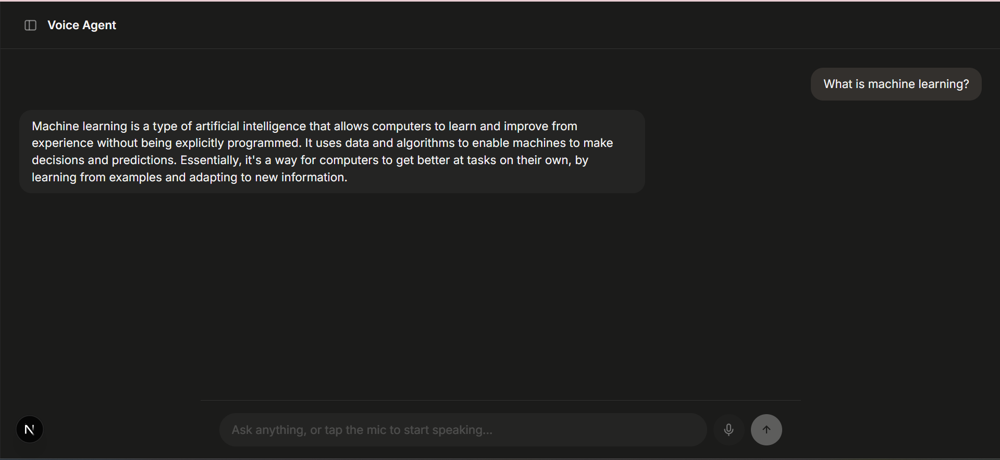
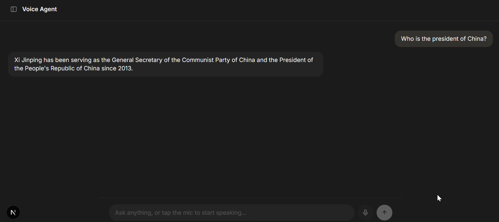
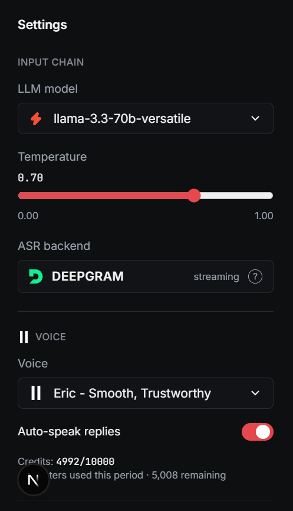
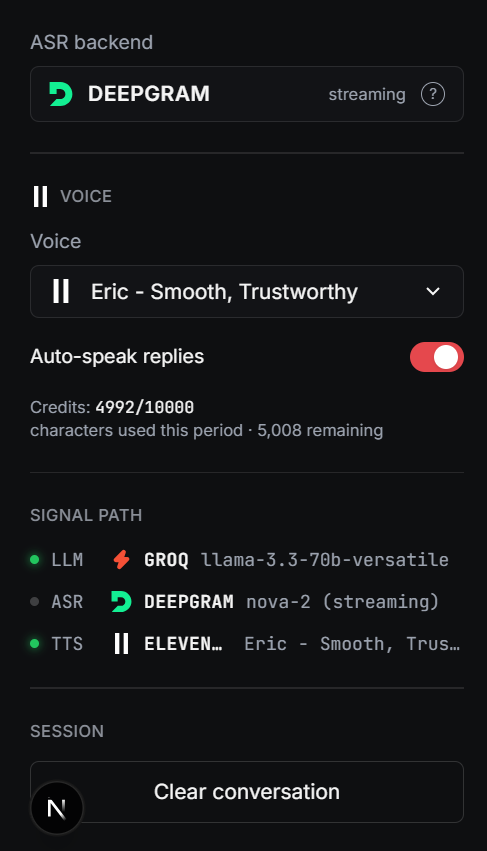
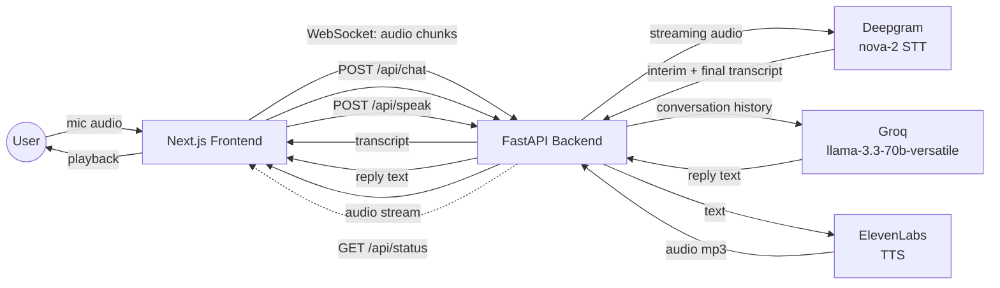

# Voice Agent

A real-time voice AI agent that listens, thinks, and talks back.


## Demo
🔊 [Watch the full demo](https://drive.google.com/drive/folders/1GX9OdliNGOY-NWjfq_QdfzqjoIM0q9PD?usp=sharing)

| Text chat | General knowledge Q&A |
|---|---|
|  |  |

| Full settings panel | Live signal path |
|---|---|
|  |  |

## Overview

You talk, the agent transcribes what you said, reasons over it with an LLM, and
replies out loud. There's no tool-calling here — it's a pure conversational
voice loop: **listen → think → speak**, one turn at a time.

The interface pairs a dark, minimal **chat widget** with a **settings sidebar**
showing the live signal path (ASR → LLM → TTS), model/voice selection, and
usage — both in the same dark gray palette, so the whole thing reads as one
cohesive surface rather than two bolted-together panels.

It's also turn-based, not full-duplex — the agent waits for you to stop
talking (via Deepgram's endpointing) before it responds, rather than holding a
continuously open call-style connection both ways at once.

## Features

- Real-time streaming transcription (Deepgram), with live interim captions
- Conversational LLM replies (Groq `llama-3.3-70b-versatile`), no tool-calling
- Natural TTS playback (ElevenLabs), triggerable per-reply or on auto-speak
- Live signal-path diagnostics — each provider's connection health, not a static decoration
- ElevenLabs character usage/credit tracking
- Single dark, focused UI — no light/dark split, consistent throughout

## Tech stack

| Layer | Technology | Provider |
|---|---|---|
| ASR (speech-to-text) | Streaming websocket | Deepgram (`nova-2`) |
| LLM | Chat completions | Groq (`llama-3.3-70b-versatile`) |
| TTS (text-to-speech) | REST | ElevenLabs |
| Frontend | Next.js (App Router), TypeScript, React, Tailwind CSS | — |
| Backend | Python, FastAPI, `uvicorn` | — |

FastAPI was chosen over Flask specifically for native async/WebSocket
support — needed for Deepgram's streaming connection and for pushing live
signal-path status to the frontend.

## Architecture



The frontend never talks to Deepgram, Groq, or ElevenLabs directly — every
provider call goes through the FastAPI backend. That's the whole reason for
the split: provider API keys live only on the backend, never in a browser
bundle or client-side env var.

State machine for a single turn: `idle -> listening -> processing -> speaking -> idle`.

## Project Structure

```
voice-agent/
├── backend/
│   ├── providers/
│   │   ├── deepgram_client.py      # Deepgram streaming STT (WebSocket)
│   │   ├── groq_client.py          # Groq LLM chat completion
│   │   └── elevenlabs_client.py    # ElevenLabs TTS + voice list/usage
│   ├── app.py                      # FastAPI app, routes (/api/*, /ws/stt)
│   ├── config.py                   # Central env var loader
│   ├── state.py                    # In-memory provider health tracking
│   ├── .env                        # Local secrets (gitignored, never committed)
│   ├── .env.example                # Template with blank values
│   ├── requirements.txt            # Pinned direct dependencies
│  
│
├── frontend/
│   ├── app/
│   │   ├── layout.tsx              # Root layout, fonts, dark theme
│   │   ├── page.tsx                # Home page, wires sidebar + chat
│   │   └── globals.css             # Tailwind base, dark theme, scrollbars
│   ├── components/
│   │   ├── icons/
│   │   │   └── ProviderIcons.tsx   # Groq / Deepgram / ElevenLabs brand marks
│   │   ├── ChatWidget.tsx          # Chat UI, mic streaming, TTS playback
│   │   └── SettingsSidebar.tsx     # Model/voice/temperature settings panel
│   ├── lib/
│   │   ├── api.ts                  # fetch/WebSocket calls to the backend
│   │   ├── audio.ts                # Mic capture -> PCM16 -> WebSocket stream
│   │   └── types.ts                # Shared TS types (ChatMessage, VoiceState, etc.)
│   ├── .env.local                  # NEXT_PUBLIC_* vars (gitignored)
│   ├── next.config.ts              # output: "standalone" (if self-hosting)
│   ├── tailwind.config.ts          # Dark theme color tokens
│   ├── tsconfig.json
│   └── package.json
│
├── .gitignore                      # Root-level: env files, node_modules, __pycache__, etc.
└── README.md
```

## Getting started

### Backend setup

Requires Python 3.10+ (uses modern type-hint syntax).

```bash
git clone https://github.com/m-sameerkhan/voice-ai-agent.git
cd voice-ai-agent/backend
python -m venv .venv
source .venv/bin/activate    # Windows: .venv\Scripts\activate
pip install -r requirements.txt
cp .env.example .env
# fill in GROQ_API_KEY, DEEPGRAM_API_KEY, ELEVENLABS_API_KEY
# (+ ELEVENLABS_VOICE_ID, FRONTEND_ORIGIN)
uvicorn app:app --reload --port 8000
```

### Frontend setup

Requires Node 20+.

```bash
cd frontend
npm install
cp .env.example .env.local
# set NEXT_PUBLIC_BACKEND_URL=http://localhost:8000
# and NEXT_PUBLIC_BACKEND_WS_URL=ws://localhost:8000
npm run dev
```

Open `http://localhost:3000` — the backend needs to already be running for
the chat widget and sidebar to have anything to talk to.

## Environment variables

| Variable | Service | Description |
|---|---|---|
| `GROQ_API_KEY` | backend | Auth key for Groq's chat completions API |
| `DEEPGRAM_API_KEY` | backend | Auth key for Deepgram's streaming STT API |
| `ELEVENLABS_API_KEY` | backend | Auth key for ElevenLabs' TTS API |
| `ELEVENLABS_VOICE_ID` | backend | Fallback voice used only if a request omits one — the sidebar's dropdown lets you pick per-request regardless |
| `FRONTEND_ORIGIN` | backend | Origin allowed through CORS |
| `NEXT_PUBLIC_BACKEND_URL` | frontend | Base URL of the FastAPI backend |
| `NEXT_PUBLIC_BACKEND_WS_URL` | frontend | Websocket URL of the same backend, for streaming STT |

No real key values are ever committed — only `.env.example` files with the
variable names.


## Known Limitations

* Turn-based, not full-duplex — the agent waits for you to finish speaking before it responds
* No live web access — the LLM answers from training data only, so current-events questions may be outdated depending on when the model was last trained (e.g. a "who is the president of X" question happens to still check out today, but that won't hold forever)
* Subject to Deepgram/Groq/ElevenLabs free-tier rate and character limits

## Future goals

- **Persistent conversation history** — store past sessions (Postgres/SQLite) instead of losing them on refresh
- **Streamed token-by-token LLM replies** — start speaking/rendering before the full completion finishes, cutting perceived latency
- **Full-duplex / continuous listening** — allow interrupting the agent mid-reply instead of strict turn-taking
- **More Groq-hosted models** in the dropdown as they become available
- **Tool-calling** — let the agent actually look things up (web search, calendar, etc.) instead of answering from training data alone
- **Deployment** — SnapDeploy's free tier doesn't support persistent WebSocket connections (auto-sleeps idle containers); always-on hosting requires their paid tier (~$12/month). No live hosted demo right now, but you can deploy it yourself using the Dockerfile and setup instructions above

